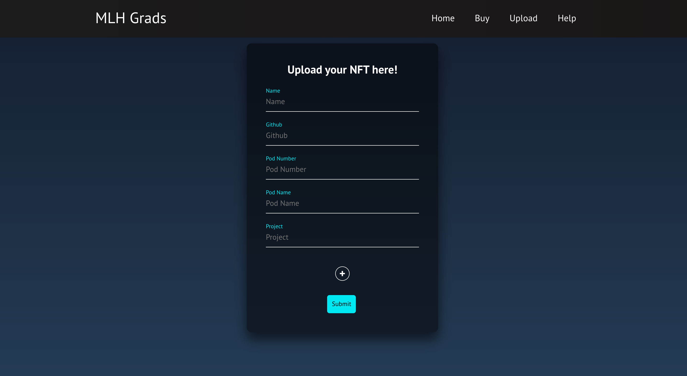

<h1 align="center"> MLH Grads</h1>

What could be better than an exclusive NFTs for MLH graduates in AR!  
MLH Grads is a decentralised application (dApp) that makes it simple to create your MLH Graduation NFT on the Solana Blockchain. It supports two wallets, each of which offers a simple way to complete a transaction. You can easily sell and buy MLH fellows NFTs on this platform. We verify the NFT by GitHub username as the username should belong to the MLH fellowship organisation!

  
  

## What it does :
- Users may log in to the app by connecting their wallet. 
- Only MLH fellows will be allowed to create a NFT with up to 30 characters of name, 30 characters of pod name, and 39 characters of Github username. 
- Anyone can buy the NFTs at listed price. 
- NFTs can also be viewed in AR. 

### Screenshot

 
 

## 👇 Prerequisites

Before installation, please make sure you have already installed the following tools: 
- [Solana](https://docs.solana.com/cli/install-solana-cli-tools) 
- [Rust](https://www.rust-lang.org/tools/install)
- [NPM](https://project-serum.github.io/anchor/getting-started/installation.html#install-yarn_)
- [Anchor](https://github.com/project-serum/anchor)

some other optional prerequisites if you are interested in contributing.
- [Git](https://git-scm.com/downloads)

## 🛠️ Installation Steps

1. Fork the project
2. Clone the project
3. change directory to the project.
4. Build the program by running ``anchor build`` 
5. Once built, connect to any [cluster](https://docs.solana.com/cli/choose-a-cluster) and run the deploy command which you got at the end of build command or just run ``anchor deploy``.
6. Add the IDL created to the app folder by running the command ` anchor run copy-idl `
7. `cd app/`
8. `npm install`
9. `npm start`

## 👨‍💻 Contributing

- Any contributions you make are **greatly appreciated**.

### Bug / Feature Request

If you find a bug in the dApp/website, kindly open an issue by
including a proper description about the bug and the expected result. Similarly, we would be glad to hear about new
features to add in the project, kindly follow same procedure for it too.

## 🛡️ License

MLH Grads is licensed under the MIT License - see the [`LICENSE`](LICENSE.txt) file for more information.

### Contributors
- [anamansari062](https://github.com/anamansari062)
- [arcAman07](https://github.com/arcAman07)
- [Dhruv-Sachdev1313](https://github.com/Dhruv-Sachdev1313)

## Recognition
This repository/project is a submission to MLH fellowship orientation hackathon.

## 🙏 Support
Do ⭐️ the project if you like it :)
